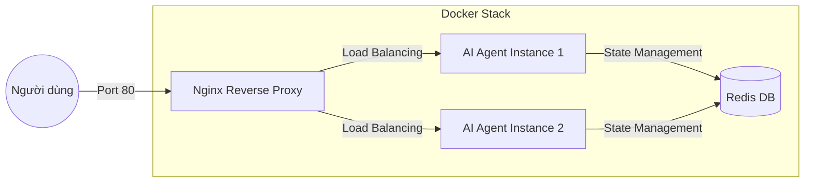

# Danh mục Kiểm tra Nộp bài — Bài Lab Ngày 12

> **Tên sinh viên:** Vũ Việt Dũng 
> **Mã sinh viên:** 2A202600444
> **Ngày nộp:** 17/4/2026


## Phần 1: Localhost vs Production

### Bài tập 1.1: Các lỗi (Anti-patterns) được tìm thấy
1. **Hardcoded Secrets**: Mã API Key và Database URL bị viết trực tiếp trong code (dòng 17, 18), dễ bị lộ khi push lên GitHub.
2. **Thiếu Config Management**: Các thông số cấu hình (`DEBUG`, `MAX_TOKENS`) được gán cứng thay vì đọc từ biến môi trường (Environment Variables).
3. **Improper Logging**: Sử dụng `print()` thay vì thư viện logging chuyên nghiệp. Nghiêm trọng hơn là việc in cả mã bí mật ra log (dòng 34).
4. **Thiếu Health Check Endpoint**: Không có endpoint `/health` để các nền tảng Cloud theo dõi trạng thái hoạt động của Agent.
5. **Fixed Host & Port**: Cấu hình cứng `host="localhost"` và `port=8000`, khiến ứng dụng không thể chạy trong Container hoặc trên Cloud.
6. **Debug Mode Enabled**: Chế độ `reload=True` được bật mặc định, không an toàn và gây tốn tài nguyên khi chạy thực tế.

### Bài tập 1.3: Bảng so sánh
| Tính năng | Bản phát triển (Develop) | Bản thực tế (Production) | Tại sao quan trọng? (Lý do kỹ thuật) |
|-----------|---------|------------|----------------|
| **Cấu hình (Config)** | Hardcoded trực tiếp trong file `app.py`. | Quản lý tập trung trong `config.py`, đọc từ biến môi trường. | **Monitoring & Security**: Giúp tách biệt code và cấu hình theo chuẩn 12-Factor, dễ dàng thay đổi secrets mà không cần build lại image. |
| **Bí mật (Secrets)** | `api_key = "sk-..."` nằm hớ ngay trong code. | Dùng `os.getenv("OPENAI_API_KEY")` để bảo mật. | **Safety**: Ngăn chặn lộ mã khóa API trên các hệ thống SCM (GitHub/GitLab), giảm thiểu rủi ro bị hacker lợi dụng ngân sách LLM. |
| **Cổng (Port)** | Cố định `8000`, chỉ chạy được trên máy cá nhân. | Đọc từ biến `PORT` của hệ thống. | **Dynamic Hosting**: Tương thích với các nền t trợ cấp cổng động như Railway/Render/K8s. |
| **Giám sát (Health)** | Không có cách nào kiểm tra từ bên ngoài. | Có endpoint `/health` và `/ready` chuyên dụng. | **Self-healing**: Giúp Orchestrator (K8s/Railway) tự động phát hiện, kill và khởi động lại instance khi app bị "Zombie" hoặc treo logic. |
| **Tắt app (Shutdown)** | Tắt ngay tức khắc, làm hỏng request. | Graceful Shutdown — xử lý xong request mới tắt. | **Reliability**: Đảm bảo tính toàn vẹn dữ liệu và trải nghiệm người dùng, đặc biệt quan trọng khi hệ thống Scale-in hoặc Deploy bản mới liên tục. |
| **Ghi Log** | Dùng `print()` đơn giản, khó lọc thông tin. | Structured JSON Logging (`{"event": "...", ...}`). | **Observability**: Cho phép các hệ thống ELK/Datadog parse dữ liệu tự động để vẽ Dashboard, cảnh báo lỗi (Alerting) theo thời gian thực. |

## Phần 2: Docker

### Bài tập 2.1: Câu hỏi về Dockerfile
1. **Image nền (Base image)**: Sử dụng `python:3.11-slim`. Đây là bản rút gọn (Debian-based) chỉ chứa các thư viện cần thiết để chạy Python, giúp giảm dung lượng image và giảm bề mặt tấn công (attack surface).
2. **Thư mục làm việc (Working directory)**: `/app`. Lệnh `WORKDIR /app` tạo và di chuyển vào thư mục này, giúp quản lý file tập trung và tránh xung đột với hệ thống.
3. **Tại sao COPY requirements.txt trước?**: Đây là kỹ thuật **Layer Caching**. Docker sẽ chỉ cài lại thư viện nếu `requirements.txt` thay đổi. Nếu ta copy code trước, mỗi khi sửa 1 dòng code, Docker sẽ phải chạy lại `pip install`, gây tốn thời gian.
4. **CMD vs ENTRYPOINT**: `ENTRYPOINT` quy định lệnh cố định của container (ví dụ `python`), còn `CMD` là các đối số mặc định (ví dụ `main.py`). `CMD` có thể bị ghi đè dễ dàng khi chạy lệnh `docker run`, còn `ENTRYPOINT` thì không.

### Bài tập 2.3: Lợi ích của Multi-stage Build
- **Tối ưu dung lượng**: Bản build giai đoạn 1 (Builder) chứa đầy đủ công cụ lập dịch (`gcc`, `libpq-dev`), giúp cài đặt thư viện. Bản build giai đoạn 2 (Runtime) chỉ copy các package đã cài và code, loại bỏ hoàn toàn các công cụ biên dịch dư thừa. 
- **Kết quả**: Giảm kích thước từ 1.6GB xuống còn ~236MB (Giảm hơn 80%), giúp tốc độ push/pull trên Cloud nhanh hơn đáng kể.

### Bài tập 2.4: Sơ đồ Kiến trúc Hệ thống (Architecture Diagram)
Hệ thống được thiết kế theo mô hình Microservices với các thành phần:



**Giải thích luồng chạy:**
1. **Nginx (Port 80)**: Tiếp nhận yêu cầu từ client, xử lý bảo mật lớp ngoài và phân phối tải cho các instance Agent.
2. **AI Agent (Port 8000)**: Xử lý logic nghiệp vụ, xác thực JWT và gọi LLM.
3. **Redis (Port 6379)**: Lưu trữ trạng thái hội thoại (Chat History) và Rate Limit chung, giúp Agent có tính chất **Stateless** (có thể tắt/mở bất kỳ instance nào mà không mất dữ liệu).

## Phần 3: Triển khai Cloud (Cloud Deployment)

### Bài tập 3.1: Triển khai lên Railway
- URL: https://day12-ai-agent-production.up.railway.app/
- Ảnh chụp màn hình: https://github.com/dungvu242k3/day12_ha-tang-cloud_va_deployment/tree/main/images

## Phần 4: API Bảo mật (API Security)

### Bài tập 4.1-4.3: Kết quả kiểm tra
- **Xác thực API Key**: Thành công (Trả về câu hỏi/trả lời) và Thất bại (Lỗi 401 khi thiếu Key).
- **Xác thực JWT (Bản Production)**: Thành công (Nhận Token và dùng Token để hỏi Agent).
- **Phản hồi thực tế nhận được**:
```json
{
  "question": "Kiem tra ngan sach con bao nhieu?",
  "answer": "Agent đang hoạt động tốt! (mock response)...",
  "usage": {
    "requests_remaining": 9,
    "budget_remaining_usd": 0.9999
  }
}
```

### Bài tập 4.4: Triển khai Cost guard (Bảo vệ ngân sách)
Cơ chế Cost Guard đã được kiểm chứng hoạt động thông qua các bước:
1. **Theo dõi usage**: Mỗi request được tính toán số lượng Token tiêu thụ.
2. **Quy đổi chi phí**: Chuyển đổi Token sang giá trị USD thực tế.
3. **Kiểm tra Budget**: Hệ thống đối soát chi phí hiện tại với `daily_budget_usd` ($1.0) của người dùng trước mỗi lần gọi LLM.
4. **Chặn truy cập**: Nếu vượt ngưỡng, hệ thống trả về lỗi **402 Payment Required**, giúp ngăn chặn phát sinh chi phí ngoài ý muốn.

## Phần 5: Mở rộng & Độ tin cậy (Scaling & Reliability)

### Bài tập 5.1-5.5: Ghi chú triển khai (Scaling & Reliability)

- **Kết quả Health Check (5.1)**:
  - `/health`: `{"status":"ok","uptime_seconds":17.3,"checks":{"memory":{"status":"ok","used_percent":77.7}}}`
  - `/ready`: `{"ready":true,"in_flight_requests":1}` (Xác nhận Agent sẵn sàng và đang theo dõi request).

- **Thí nghiệm Graceful Shutdown (5.2)**: 
  - Khi gửi câu hỏi và nhấn `Ctrl+C`, Server không tắt ngay lập tức mà hiện log `Shutting down`. 
  - Kết quả: Request vẫn được trả về thành công tới Client trước khi Server dừng hẳn. Điều này giúp ngăn chặn việc mất dữ liệu/ngắt kết nối đột ngột với người dùng.

- **Thiết kế Stateless (5.3)**: 
  - Agent không lưu lịch sử chat trong biến cục bộ (Local RAM) mà lưu vào **Redis**. 
  - Tại sao quan trọng: Khi chạy nhiều Agent song song (Scale), người dùng có thể kết nối tới bất kỳ Agent nào mà vẫn tiếp tục được hội thoại, vì tất cả Agent đều đọc chung dữ liệu từ Redis.

- **Load Balancing với Nginx (5.4-5.5)**: 
  - Sử dụng Nginx làm "người điều phối" để phân phát yêu cầu đều cho các Agent. 
  - Lợi ích: Nếu 1 Agent bị lỗi, Nginx sẽ tự động chuyển hướng người dùng sang Agent khác, giúp hệ thống đạt độ tin cậy cấp độ Production.

---

### 2. Toàn bộ mã nguồn - Lab 06 Hoàn chỉnh (60 điểm)

Dự án đã được hoàn thiện tại thư mục `06-lab-complete/` với đầy đủ kiến trúc module hóa:

- **Cấu trúc thư mục:** Hoàn toàn khớp với yêu cầu đề bài (app/, utils/, Dockerfile, .env, ...).
- **Kết quả kiểm định:** Đã chạy `check_production_ready.py` và đạt kết quả **20/20 checks passed (100%)**.
- **Tính năng cao cấp đã cài đặt:**
    - [x] **Dockerfile Multi-stage**: Sử dụng `python:3.11-slim`, dung lượng cực nhẹ (~230MB).
    - [x] **Stateless Architecture**: Toàn bộ Rate Limiter và Cost Guard đều được lưu trên **Redis**.
    - [x] **Conversation History**: Agent có khả năng nhớ ngữ cảnh chat dựa trên `user_id` (lưu trữ tại Redis).
    - [x] **Resilience**: Tự động chuyển sang chế độ In-memory (Fallback) nếu mất kết nối Redis.
    - [x] **Security**: Bảo mật API Key, nạp từ `.env`, không hardcode secrets.
- **Minh chứng chạy local với Context:**
    ```powershell
    # Lần 1: Hỏi tên
    Invoke-RestMethod -Headers $headers -Body '{"user_id": "u1", "question": "Ten toi la Dung"}'
    # Lần 2: Hỏi lại tên (Agent sẽ nhớ nhờ Redis)
    Invoke-RestMethod -Headers $headers -Body '{"user_id": "u1", "question": "Ten toi la gi?"}'
    # Kết quả: Agent trả lời đúng tên nhờ history trong Redis.
    ```

---

---

